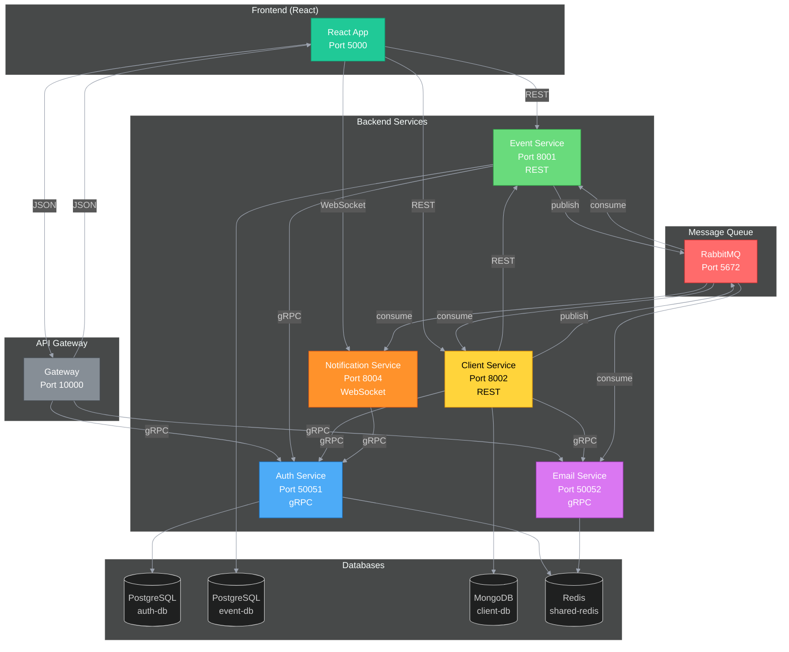

## Architecture Overview



> [!TIP]
> The entire backend is built in **Rust** using the **Axum** web framework. Each service has detailed documentation in the `doc/` folder:
>
> **Services:**
> - [Gateway](doc/gateway.md) — API Gateway with rate limiting (Port 10000)
> - [Auth Service](doc/auth-service.md) — Authentication & JWT management (Port 50051, gRPC)
> - [Event Service](doc/event-service.md) — Event, ticket & refund management (Port 8001, REST)
> - [Client Service](doc/client-service.md) — Client profiles & ticket purchases (Port 8002, REST)
> - [Email Service](doc/email-service.md) — Email delivery & verification codes (Port 50052, gRPC)
> - [Notification Service](doc/notification-service.md) — Real-time WebSocket notifications (Port 8004)
>
> **Infrastructure:**
> - [RabbitMQ](doc/rabbitmq.md) — Message broker for async communication
> - [Grafana](doc/grafana.md) — Monitoring & logging dashboard

## Quick Start

```bash
# Start all services
docker-compose up -d

# View logs
docker-compose logs -f

# Stop services
docker-compose down

# Full cleanup (removes database volumes)
docker-compose down -v
```

> [!NOTE]
> All databases are stored in Docker volumes for persistence. Use `docker-compose down -v` for a complete cleanup including all data.

