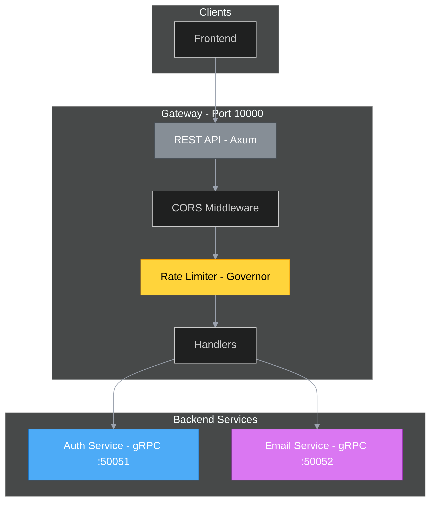

# Gateway



API Gateway providing rate limiting and proxying to auth/email gRPC services.

## How It Works

The Gateway is the main entry point for authentication and email operations, translating REST requests to gRPC calls.

**Request Flow:**
1. Frontend sends REST request
2. CORS middleware validates origin
3. Rate limiter checks request quota
4. Handler translates to gRPC call
5. Response returned to frontend

**Rate Limiting:**
- Uses Token Bucket algorithm (rather simple in comparison to other algorithms)
- Returns 429 Too Many Requests with Retry-After header

## REST Endpoints

### Authentication
| Method | Endpoint | Proxies To |
|--------|----------|------------|
| `POST` | `/auth/login` | Auth.Authenticate |
| `POST` | `/auth/logout` | Auth.DestroyToken |
| `POST` | `/auth/validate` | Auth.ValidateToken |

### Email
| Method | Endpoint | Proxies To |
|--------|----------|------------|
| `POST` | `/email/send-verification` | Email.SendVerificationEmail |
| `POST` | `/email/verify` | Email.VerifyCode |
| `POST` | `/email/resend` | Email.ResendVerificationCode |
| `POST` | `/email/forgot-password` | Email.SendPasswordResetEmail |
| `POST` | `/email/reset-password` | Email.VerifyPasswordResetCode |

## Rate Limit Response

```http
HTTP/1.1 429 Too Many Requests
Retry-After: 30

{
  "error": "Too many requests",
  "retry_after": 30
}
```
