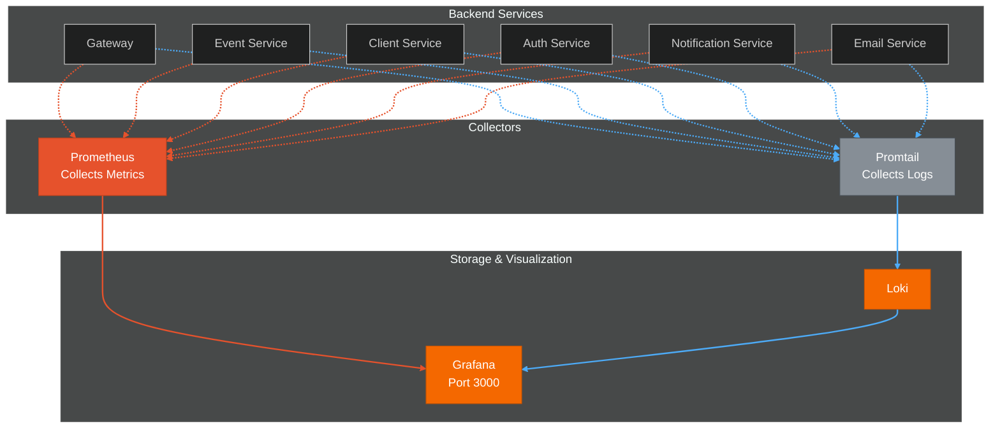
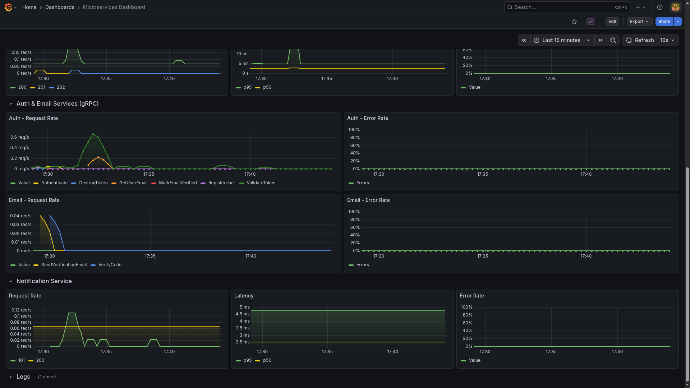
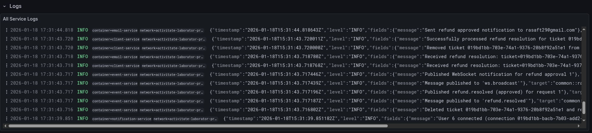

# Grafana



Monitoring and visualization dashboard for service metrics and logs.

## How It Works

Grafana connects to Prometheus for metrics and Loki for logs.

### Metrics
*Prometheus* scrapes metrics from all backend services via the `/metrics` endpoint that each one exposes
**Collected:** Request count, latency, error rates, active connections.

### Logs
*Promtail* collects logs from Docker containers and pushes them to *Loki*. Grafana queries *Loki* to display logs alongside metrics.
**Collected:** Application logs, warnings, errors, panic traces.

---

## Dashboard Overview

<div align="center">


</div>

<div align="center">



</div>

<div align="center">



</div>


---

## Access

```
URL: http://localhost:3000
Default credentials: admin / admin
```

## Configuration

Grafana configuration is located in `yamls/grafana/` directory with pre-configured dashboards and Prometheus data source.
