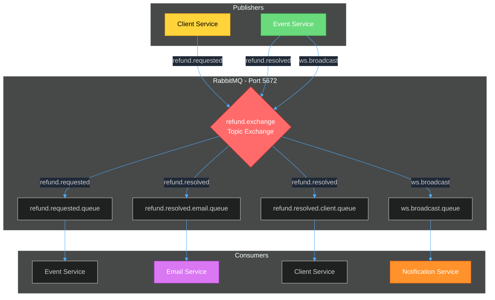
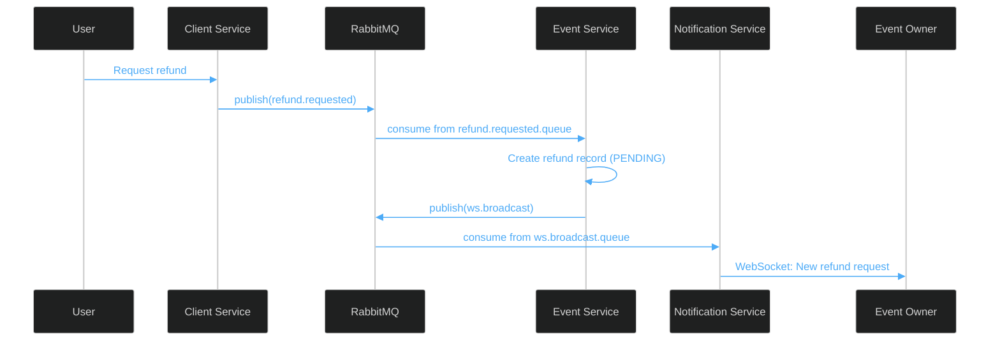
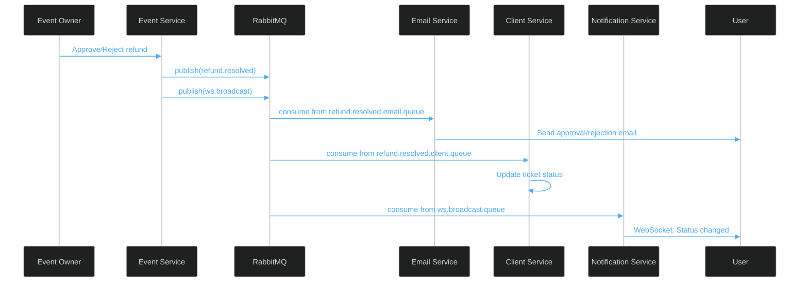

# RabbitMQ



Message broker for async communication between services using topic exchange pattern.

## How It Works

RabbitMQ enables decoupled, asynchronous communication for the refund workflow. Services publish messages to a topic exchange, which routes them to queues based on routing keys.

**Exchange:** `refund.exchange` (Topic type, durable)

**Pattern:** Publisher → Exchange → Queue(s) → Consumer(s)

---

## Message Flow

### 1. Refund Request Flow



### 2. Refund Resolution Flow



---

## Queues & Routing

| Queue | Routing Key | Consumer | Purpose |
|-------|-------------|----------|---------|
| `refund.requested.queue` | `refund.requested` | Event Service | Process new refund requests |
| `refund.resolved.email.queue` | `refund.resolved` | Email Service | Send approval/rejection emails |
| `refund.resolved.client.queue` | `refund.resolved` | Client Service | Update ticket status in MongoDB |
| `ws.broadcast.queue` | `ws.broadcast` | Notification Service | Push real-time WebSocket updates |

---

## Message Types

### RefundRequested
```json
{
  "request_id": 123,
  "ticket_cod": "TKT-ABC123",
  "requester_id": 1,
  "requester_email": "user@example.com",
  "event_id": 5,
  "event_owner_id": 2,
  "reason": "Cannot attend"
}
```

### RefundResolved
```json
{
  "request_id": 123,
  "ticket_cod": "TKT-ABC123",
  "requester_email": "user@example.com",
  "status": "APPROVED",
  "event_name": "Summer Festival",
  "message": null
}
```

### WebSocketMessage
```json
{
  "type": "refund_status_changed",
  "request_id": 123,
  "ticket_cod": "TKT-ABC123",
  "status": "APPROVED",
  "user_id": 1
}
```